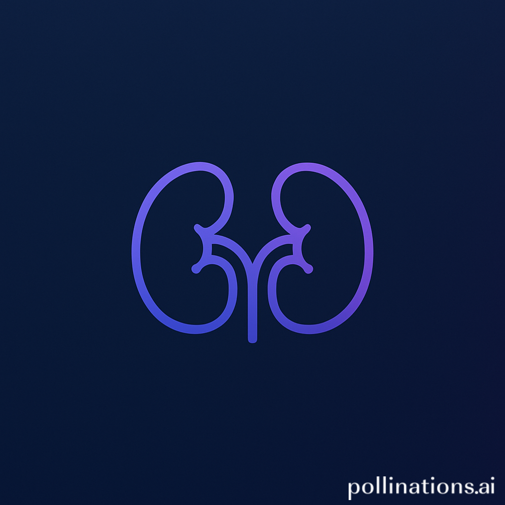

# KidneyInsight

<div align="center">
  
</div>

<h1 align="center">An Interactive Journey into Kidney Function Regulation</h1>

<p align="center">
  <a href="#introduction"><strong>Introduction</strong></a> ·
  <a href="#features"><strong>Features</strong></a> ·
  <a href="#tech-stack"><strong>Tech Stack</strong></a> ·
  <a href="#getting-started"><strong>Getting Started</strong></a> ·
  <a href="#folder-structure"><strong>Folder Structure</strong></a> ·
  <a href="#contributing"><strong>Contributing</strong></a>
</p>

<p align="center">
  
  
  
  
</p>

---

## Introduction

**KidneyInsight** is a web-based educational platform designed to make learning about the complex processes of kidney function regulation engaging and intuitive. Through a combination of interactive animations, detailed diagrams, and clear explanations, this application demystifies the vital roles of the kidneys in maintaining homeostasis.

Our goal is to provide a visually appealing and user-friendly experience for students, educators, and anyone curious about human biology.

## Features

- **Interactive Animations:** Visualize complex biological processes like the RAAS system and hormonal regulation with dynamic animations.
- **Detailed Diagrams:** Explore high-quality, zoomable diagrams of the kidney, nephron, and juxtaglomerular apparatus.
- **Step-by-Step Explanations:** Follow a structured learning path that breaks down complex topics into manageable sections.
- **Responsive Design:** Enjoy a seamless experience on any device, from desktops to smartphones.
- **Modern UI/UX:** A clean, dark-themed interface with smooth transitions and engaging micro-interactions.

## Tech Stack

- **React:** A JavaScript library for building user interfaces.
- **TypeScript:** A typed superset of JavaScript that compiles to plain JavaScript.
- **Tailwind CSS:** A utility-first CSS framework for rapid UI development.
- **Vite:** A fast build tool and development server.
- **Framer Motion:** For animations and page transitions.
- **Wouter:** A minimalist routing library for React.
- **Shadcn/UI:** A collection of reusable UI components.

## Getting Started

To get a local copy up and running, follow these simple steps.

### Prerequisites

- Node.js (v18 or higher)
- npm or yarn

### Installation

1. **Clone the repository:**
   ```sh
   git clone https://github.com/faiz4sure/temp.git
   cd temp
   ```

2. **Install dependencies:**
   ```sh
   npm install
   ```

3. **Run the development server:**
   ```sh
   npm run dev
   ```

   This will start the application on `http://localhost:5000`.

## Folder Structure

The project is organized into the following structure:

- **`client/`**: Contains the React application.
  - **`src/components/`**: Reusable UI components.
  - **`src/pages/`**: Individual pages of the application.
  - **`public/assets/`**: Images, videos, and other static assets.

## Contributing

Contributions are what make the open-source community such an amazing place to learn, inspire, and create. Any contributions you make are **greatly appreciated**.

If you have a suggestion that would make this better, please fork the repo and create a pull request. You can also simply open an issue with the tag "enhancement".

1. Fork the Project
2. Create your Feature Branch (`git checkout -b feature/AmazingFeature`)
3. Commit your Changes (`git commit -m 'Add some AmazingFeature'`)
4. Push to the Branch (`git push origin feature/AmazingFeature`)
5. Open a Pull Request

---

<p align="center">
  Made with ❤️ by faiz4sure
</p>
